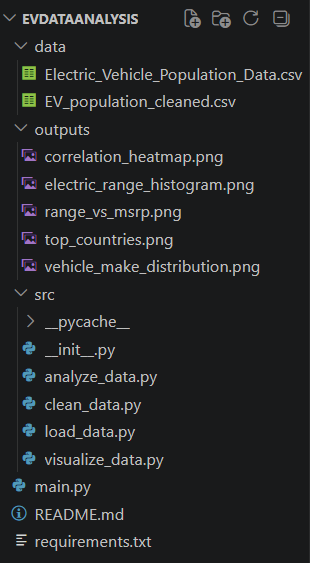
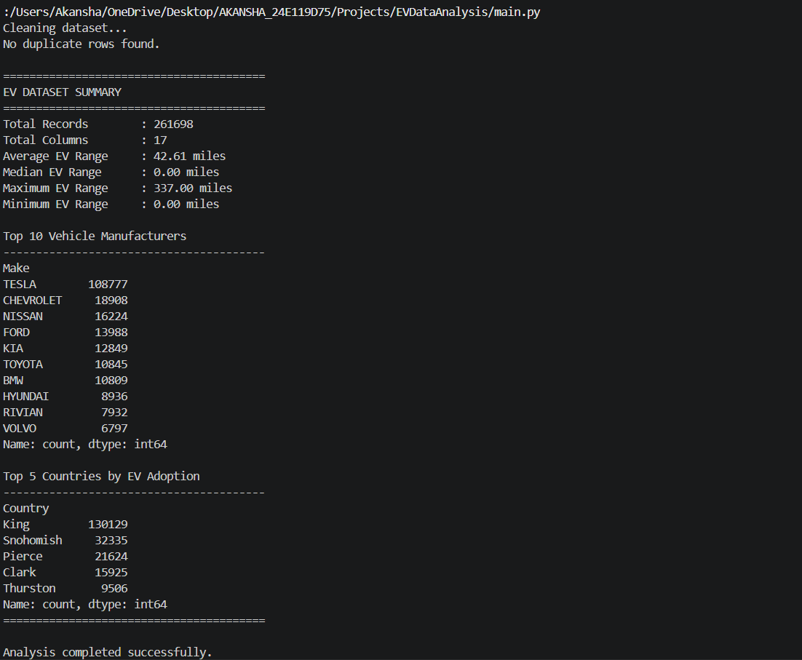
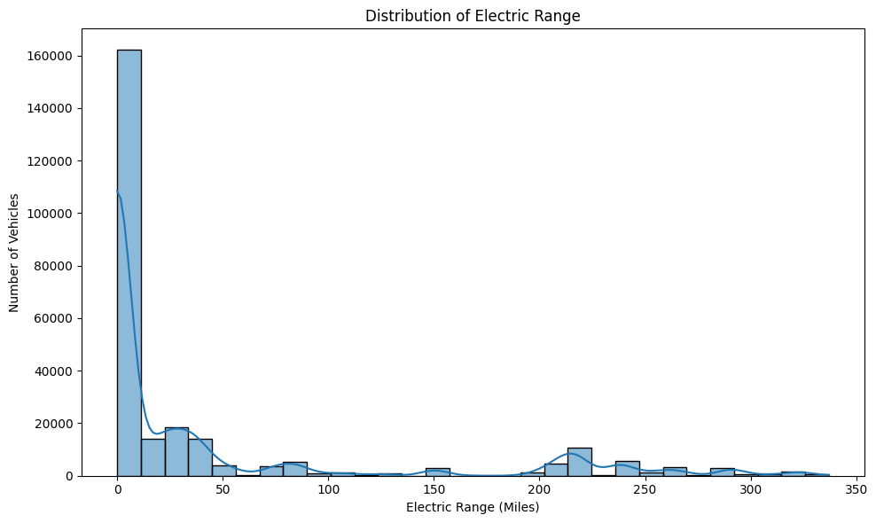
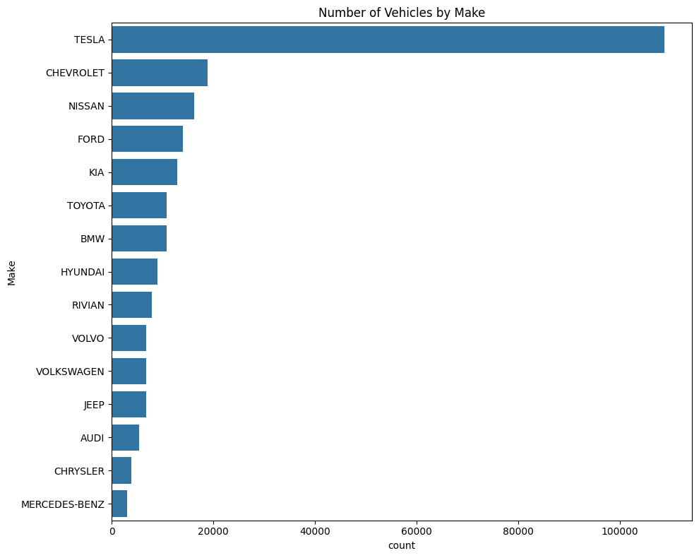
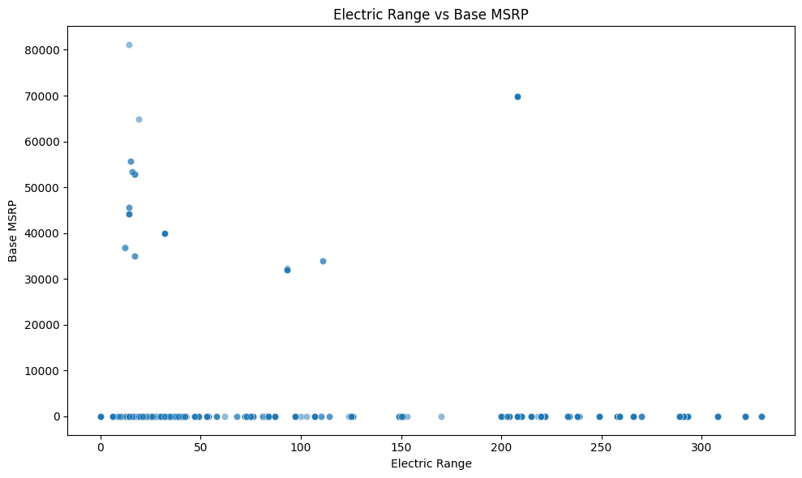
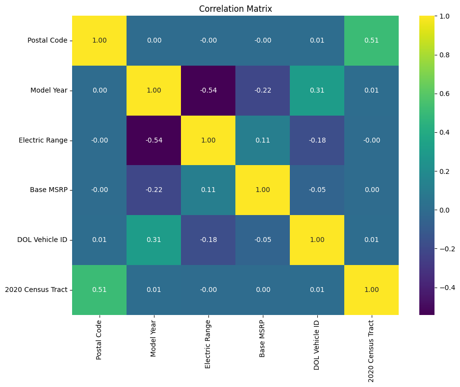
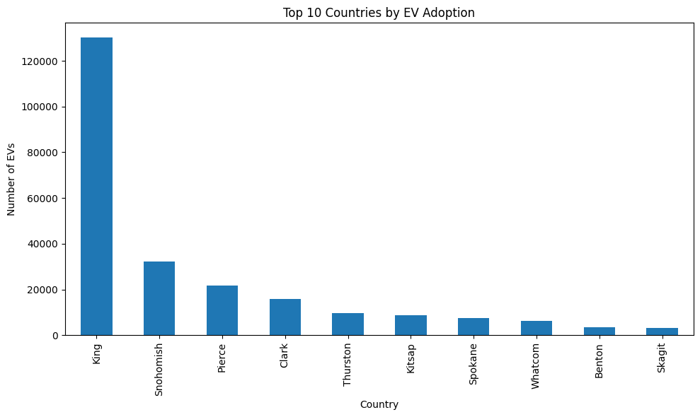

# Electric Vehicle Data Analysis

## Project Overview

This project performs data cleaning, exploratory data analysis (EDA), and visualization on the Electric Vehicle Population Dataset.

The objective is to analyze EV adoption trends, identify leading manufacturers, study electric range distributions, and explore relationships between vehicle specifications.

---

## Features

* Data loading using Pandas
* Missing value handling
* Duplicate record removal
* Statistical analysis
* Manufacturer-wise EV distribution
* Electric range analysis
* Correlation analysis
* Automated visualization generation
* Modular Python project structure

---

## Project Structure

```text
EVDataAnalysis/
│
├── data/                         # Add dataset here (not included in repo)
│   └── Electric_Vehicle_Population_Data.csv
│
├── outputs/                      # Auto-generated after running main.py
│   ├── electric_range_histogram.png
│   ├── vehicle_make_distribution.png
│   ├── range_vs_msrp.png
│   ├── correlation_heatmap.png
│   └── top_countries.png
│
├── src/
│   ├── __init__.py
│   ├── load_data.py
│   ├── clean_data.py
│   ├── analyze_data.py
│   └── visualize_data.py
│
├── main.py
├── requirements.txt
├── .gitignore
└── README.md
```

---

## Technologies Used

* Python
* Pandas
* NumPy
* Matplotlib
* Seaborn

---

## Dataset

This project uses the **Electric Vehicle Population Dataset** from Kaggle.

> The dataset is not included in this repository. You must download it manually.

Download it from:
[Electric Vehicle Population Data – Kaggle](https://www.kaggle.com/datasets/ratikkakkar/electric-vehicle-population-data)

After downloading, place the file inside the `data/` folder:

```text
EVDataAnalysis/
└── data/
    └── Electric_Vehicle_Population_Data.csv
```

The dataset contains information about:

* Vehicle Make
* Vehicle Model
* Electric Range
* Base MSRP
* Country
* Legislative District
* Vehicle Type

---

## Data Cleaning Steps

1. Filled missing values in Electric Range using median.
2. Filled missing values in Base MSRP using median.
3. Replaced missing Legislative District values with "Unknown".
4. Removed duplicate records.
5. Saved cleaned dataset.

---

## Exploratory Data Analysis

### Summary Statistics

* Total records
* Total columns
* Average electric range
* Median electric range
* Top vehicle manufacturers
* Top countries by EV adoption

### Visualizations

#### Electric Range Distribution

Shows the distribution of vehicle electric ranges.

#### Vehicle Manufacturer Distribution

Displays the most common EV manufacturers.

#### Electric Range vs Base MSRP

Analyzes the relationship between range and vehicle price.

#### Correlation Heatmap

Shows correlations among numerical variables.

#### Top Countries by EV Adoption

Highlights countries with the highest EV registrations.

---

## Sample Visualizations

### Project Structure



### Terminal Output



### Electric Range Distribution



### Vehicle Manufacturer Distribution



### Electric Range vs Base MSRP



### Correlation Heatmap



### Top Countries by EV Adoption



---

## Installation

Clone the repository:

```bash
git clone https://github.com/techieguru-oss/EVDataAnalysis.git
```

Move into the project directory:

```bash
cd EVDataAnalysis
```

Install dependencies:

```bash
pip install -r requirements.txt
```

Download the dataset from [Kaggle](https://www.kaggle.com/datasets/ratikkakkar/electric-vehicle-population-data) and place it in the `data/` folder.

---

## Running the Project

Execute:

```bash
python main.py
```

Generated visualizations will be stored inside the `outputs/` folder.

---

## Sample Output

```text
========================================
EV DATASET SUMMARY
========================================
Total Records        : 261698
Total Columns        : 17
Average EV Range     : 42.61 miles
Median EV Range      : 0.00 miles
Maximum EV Range     : 337.00 miles
Minimum EV Range     : 0.00 miles

Top 10 Vehicle Manufacturers
----------------------------------------
TESLA        108777
CHEVROLET     18908
NISSAN        16224
FORD          13988
KIA           12849
...
```

---

## Author

Akansha Singh

Computer Science Student
